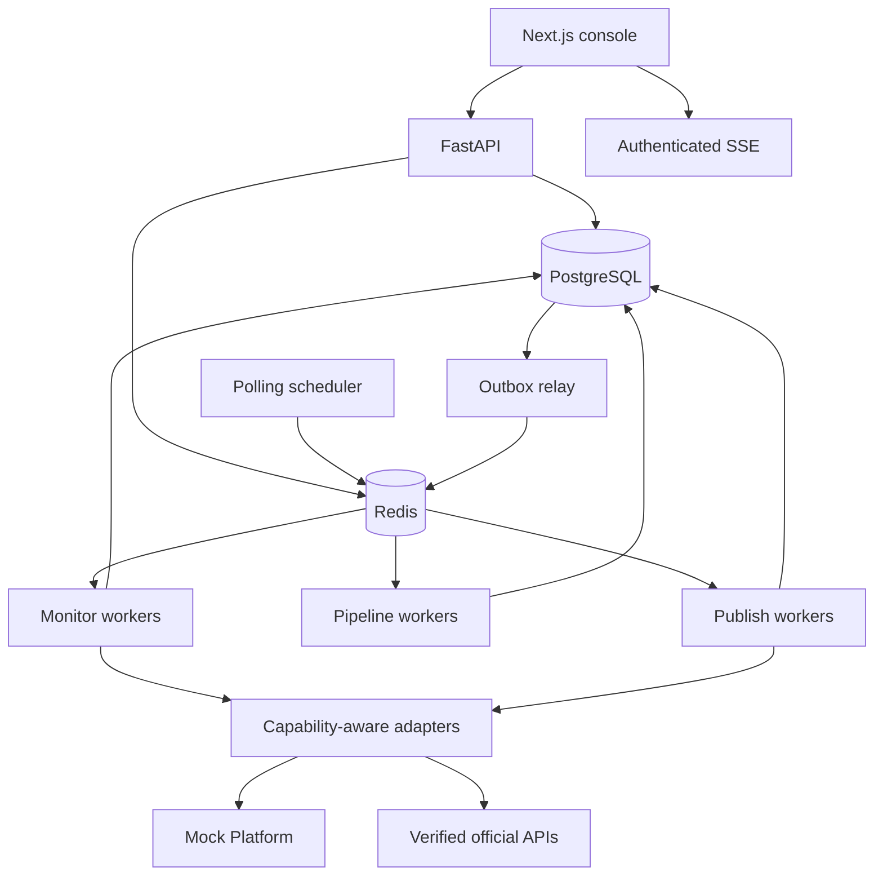

# Architecture

FirstComment Agent is a modular monolith with independently scalable worker processes. PostgreSQL is the durable source of truth; Redis is used for Dramatiq queues, adaptive polling schedules, locks, rate limiting, and short-lived cache data.

## Processing flow

1. The scheduler selects a due Creator Platform Account.
2. The monitor verifies capability and quota, calls the adapter, and deduplicates posts.
3. A new Post and `post.detected` outbox event commit in one database transaction.
4. Pipeline workers normalize content, extract concrete anchors, score the opportunity, and generate structured candidates.
5. Deterministic quality and risk rules run before semantic risk evaluation.
6. A candidate is blocked, sent to human review, routed to a verified official publisher, or packaged for manual publishing.
7. Publish timeouts become `PUBLISH_UNCERTAIN`; reconciliation happens before any retry.

## Boundaries

- `domain/` is side-effect free.
- `services/` owns orchestration and transaction boundaries.
- `platforms/` is the only layer allowed to call platform APIs.
- `agents/` owns model providers, structured output, prompts, and evaluations.
- `workers/` owns asynchronous delivery, retries, and schedules.
- The frontend only calls `/api/v1`; it does not contain platform credentials or direct platform clients.

The MVP excludes Kafka, Kubernetes, service mesh, and unverified platform APIs. Browser publishing has not been implemented; normal logged-in interaction is being evaluated as a separate channel in [the research note](browser-publishing-research-2026-09-19.md).
